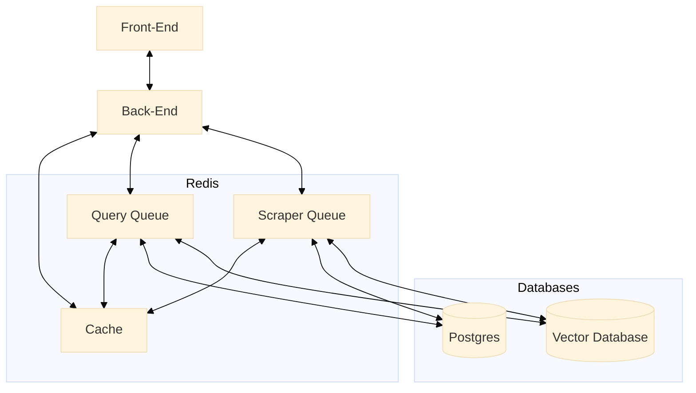

## Plum

The future of commerce is going to be led by natural language and I wanted to see what that is like.Plum is my attempt to dig into that space. Rather than navigating menus and filters, users can describe what they're looking for naturally, and the system uses a combination of LLMs and vector search to interpret that intent and surface the right results. The goal was to understand how far you can push natural language as the primary interface for a commerce-like experience. The project is still in-progress but I wanted to share my current progress.

## Demo Video

<video src="./assets/plum_demo.mov" controls="controls" style="max-width: 730px;">
</video>

## Architecture

## Tech Stack

### Front-End

- React (I'm most familiar with it so it allows me to iterate fast)
- Next.js (I liked the additional features it offers)

### Back-End

- TypeScript + Bun (fast runtime, AMAZING overall)
- Hono (lightweight and performant web framework)
- Google Generative AI (LLM provider for understanding natural language)
- Prisma (super familiar with it and its needed for Postgres)

### Database

- Qdrant (vector database for semantic search)
- Postgres (familar with it and allows us to store job-to-product relationships)
- BullMQ + Redis (job queue for async processing)

### Local Development

To get this running locally do the following.

1. Make sure you have Docker desktop installed.
2. Make sure you have mprocs installed.
3. To start both the front and back end(s), type `mprocs` in the terminal.
